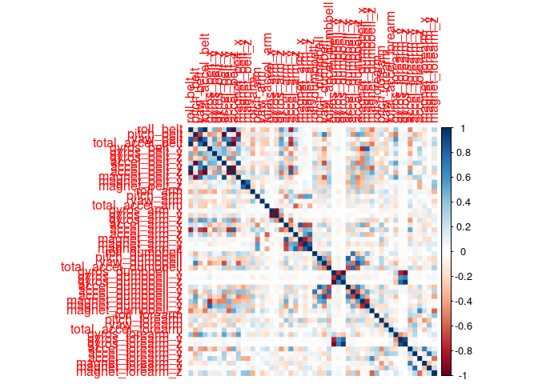

# Overview

The final report corresponding to the practical automatic learning course is shown below. In this project, data collected from accelerometers placed on 4 body parts of 6 participants was used in order to predict the way in which they performed the exercise. For the prediction, a model was trained (**Random forest**), which is then used to predict 20 cases obtained from the test set. 


# Libraries and Data

Loading required libraries and proposed data:

```r
library(ggplot2)
library(kernlab)
library(rattle)
library(corrplot)
library(caret)

set.seed(1234)
```


```r
train_data <- read.csv("./pml-training.csv")
test_data <- read.csv("./pml-testing.csv")
dim(train_data)
```

```
## [1] 19622   160
```

```r
dim(test_data)
```

```
## [1]  20 160
```


# Cleaning the Data

Eliminating N / A variables and irrelevant variables:

```r
train_data <- train_data[,colMeans(is.na(train_data)) < .9]
train_data <- train_data[,-c(1:7)]
```

Removing near zero variance variables:

```r
nvz <- nearZeroVar(train_data)
train_data <- train_data[,-nvz]
```

Division of the validation and training set:

```r
inTrain <- createDataPartition(y=train_data$classe, p=0.7, list=F)
train <- train_data[inTrain,]
valid <- train_data[-inTrain,]
```


# Correlation overview

Correlation matrix of variables in training set:

```r
corrPlot <- cor(train[, -length(names(train))])
corrplot(corrPlot, method="color")
```

<!-- -->


# Train and Testing the Model

Training process for the random forest and results obtained in the confusion matrix:

```r
cont <- trainControl(method="cv", number=3, verboseIter=F) # 3-fold cross validation.
random_forest_model <- train(classe~., data=train, method="rf", trControl = cont, tuneLength = 5)
random_forest_prediction <- predict(random_forest_model, valid)
conf_matrix <- confusionMatrix(random_forest_prediction, factor(valid$classe))
conf_matrix
```

```
## Confusion Matrix and Statistics
## 
##           Reference
## Prediction    A    B    C    D    E
##          A 1673    3    0    0    0
##          B    1 1132   11    0    0
##          C    0    4 1014    6    0
##          D    0    0    1  957    0
##          E    0    0    0    1 1082
## 
## Overall Statistics
##                                          
##                Accuracy : 0.9954         
##                  95% CI : (0.9933, 0.997)
##     No Information Rate : 0.2845         
##     P-Value [Acc > NIR] : < 2.2e-16      
##                                          
##                   Kappa : 0.9942         
##                                          
##  Mcnemar's Test P-Value : NA             
## 
## Statistics by Class:
## 
##                      Class: A Class: B Class: C Class: D Class: E
## Sensitivity            0.9994   0.9939   0.9883   0.9927   1.0000
## Specificity            0.9993   0.9975   0.9979   0.9998   0.9998
## Pos Pred Value         0.9982   0.9895   0.9902   0.9990   0.9991
## Neg Pred Value         0.9998   0.9985   0.9975   0.9986   1.0000
## Prevalence             0.2845   0.1935   0.1743   0.1638   0.1839
## Detection Rate         0.2843   0.1924   0.1723   0.1626   0.1839
## Detection Prevalence   0.2848   0.1944   0.1740   0.1628   0.1840
## Balanced Accuracy      0.9993   0.9957   0.9931   0.9963   0.9999
```

## Accuracy & Error

Summary of results, precision and error of the model: 

```
##    accuracy error
## RF    0.995 0.005
```


# Predictions on Test Set

Model prediction test, using the 20 cases given in the test set:

```r
print(predict(random_forest_model, test_data))
```

```
##  [1] B A B A A E D B A A B C B A E E A B B B
## Levels: A B C D E
```
